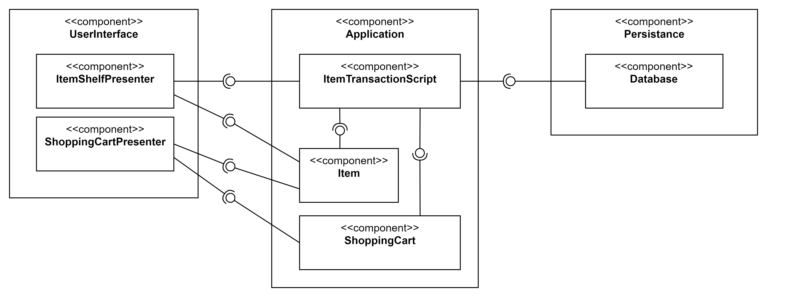
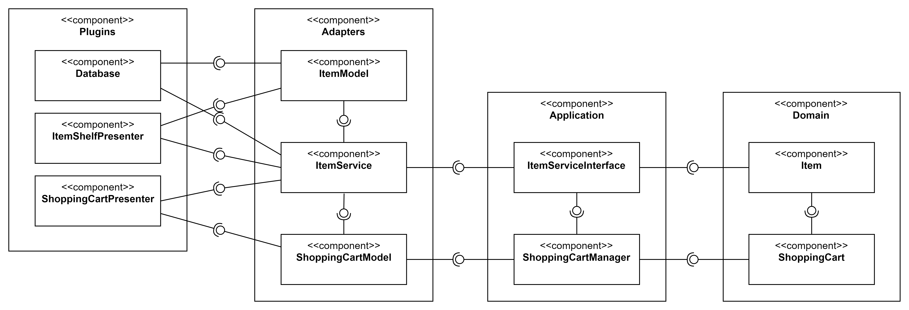

# N-Tier architecture versus Clean architecture
This repo presents a comparison of the N-tier architecture with Robert C. Martin's clean architecture.

There are two different projects for this comparison, which provide exactly the same functionality:
* When starting the application, it shows the user items that he can be added to the shopping cart.
* via the command line the user can add or remove items from the shopping cart with Add {id} or Remove {id}.
* After each add and remove, the shopping cart view is updated and the user can see how much of which goods are in his shopping cart.

Below are two diagrams (based on the UML standard for component diagrams) that visualize the architecture.

## N-Tier-Architecture (3-Tier)
Code is in the directory [CleanStore](CleanStore)

## Clean Architecture
Code is in the directory [NTierStore](NTierStore)

Note: It is not necessary to use [ItemModel.cs](CleanStore/Adapters/MappingClasses/ItemModel.cs) and [ShoppingCartModel.cs](CleanStore/Adapters/MappingClasses/ShoppingCartModel.cs), because the domain classes can be accessed directly. Here, the two adapter classes have been used explicitly so that the decoupling through the adapter layer is clarified.
